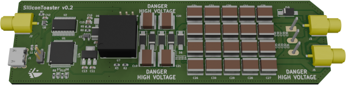

# SiliconToaster

SiliconToaster is an open-source hardware electromagnetic fault injection device, designed for hardware security research. It has the following features:

- Software programmable voltage, from 0 V to 1000 V.
- Stored energy: 1 J at 1000 V.
- Capable of multiple fault injection.
- Dual socket coil mounting, for polarity selection.
- USB-only powered.

**Warning: this device is experimental and for research purpose only. High-voltage is exposed on the PCB, which can present electrical hazard. Use with caution and at your own risk. Beware that the coil body is connected to the high potential, NOT at the ground. Also, the exposed capacitor bank stores an important amount of energy.**

## Publication

This work was published in our [Paper](https://eprint.iacr.org/2020/1115.pdf) and presented during [Hardwear.io 2020 conference](https://hardwear.io/archives/netherlands-2020/).

## Licensing

SiliconToaster is released under GNU Lesser General Public License version 3 (LGPLv3). See LICENSE and LICENSE.LESSER for license detail.
