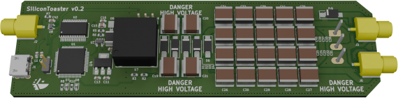

# SiliconToaster



SiliconToaster is an open-source hardware electromagnetic fault injection device, designed for hardware security research. It has the following features:

- Software programmable voltage, from 0 V to 1000 V.
- Stored energy: 1 J at 1000 V.
- Capable of multiple fault injection.
- Dual socket coil mounting, for polarity selection.
- USB-only powered.

**Warning: this device is experimental and for research purpose only. High-voltage is exposed on the PCB, which can present electrical hazard. Use with caution and at your own risk. Beware that the coil body is connected to the high potential, NOT at the ground. Also, the exposed capacitor bank stores an important amount of energy.**

## Building the firmware

To build the firmware, rust shall be installed on your system (see [instructions](https://www.rust-lang.org/tools/install) for installation).

The rust toolchain for Armv6-M Thumb must be installed:

```
rustup target add thumbv6m-none-eabi
```

The firmware can then be compiled using cargo:

```
cd firmware
cargo objcopy --release --bin silicontoaster -- -O binary silicontoaster.bin
```

To flash the device, stm32flash utility is required. The MCU bootloader can be enabled by shorting the header close to the USB connector using a jumper, before connecting the PCB on USB. Then the following command will flash the MCU (replace `/dev/ttyUSB0` with the serial device in your situation):

```
stm32flash -w silicontoaster.bin -v -g 0 /dev/ttyUSB0
```

Alternatively, a makefile can run those steps:

```
cd firmware
make all
make flash
```

To enable device recognition, the FTDI USB-serial converter must be flashed using ftdi_eeprom tool. Warning: be sure no other FTDI device is connected before running this command!

```
cd ftdi
bash flash.sh
```

## Running the software

To use the device, run `python3 silicontoaster/tool.py`. This will run a graphical interface that allows setting the operating voltage and display in real-time the voltage in the capacitors bank.

When running for the first time, configure the charge pump PID settings to `Kp`, `Ki` and `Kd` to 1. Be sure to have the jumper J5 installed (position closest to the USB).

The provided calibration values should work fine by default, it is not necessary to calibrate the device by yourself unless you want more accurate measurements.

## Publication

This work was published in our [Paper](https://eprint.iacr.org/2020/1115.pdf) and presented during [Hardwear.io 2020 conference](https://hardwear.io/archives/netherlands-2020/).

## Licensing

SiliconToaster is released under GNU Lesser General Public License version 3 (LGPLv3). See LICENSE and LICENSE.LESSER for license detail.

## Contributions

You are really welcomed to contribute to this project, by giving your feedbacks through Issues, and propose some changes with Pull Requests.

We would like to thank following contributors for this project:

- Sven Freud, from Germany
